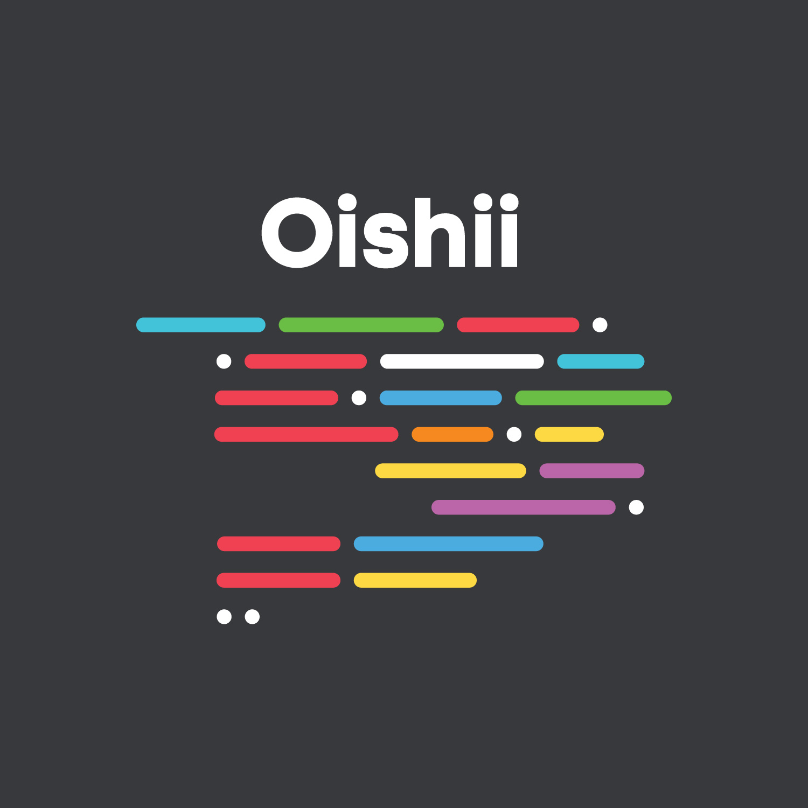
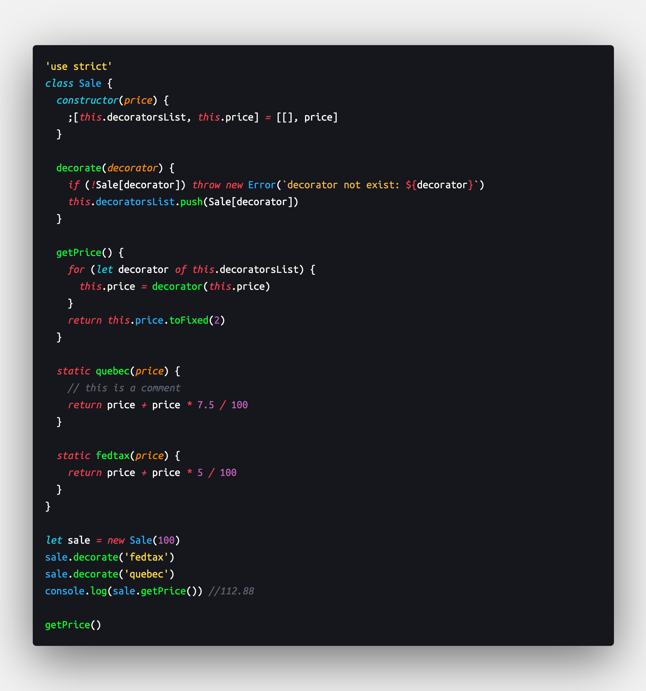
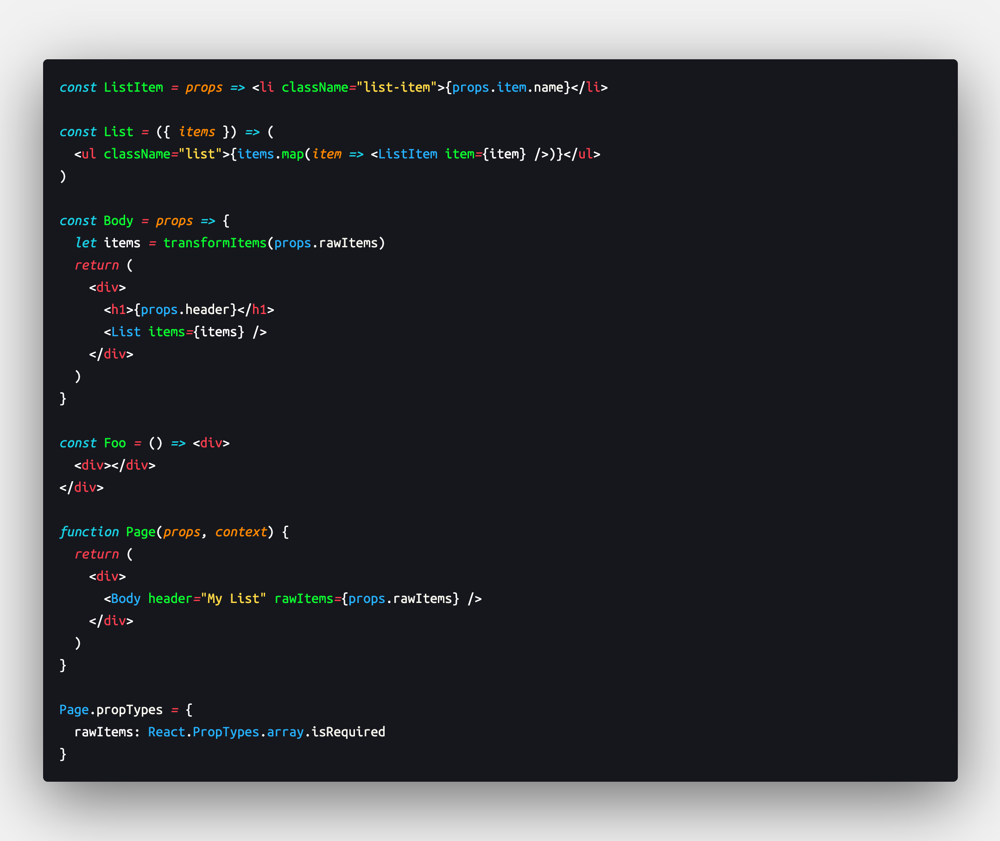
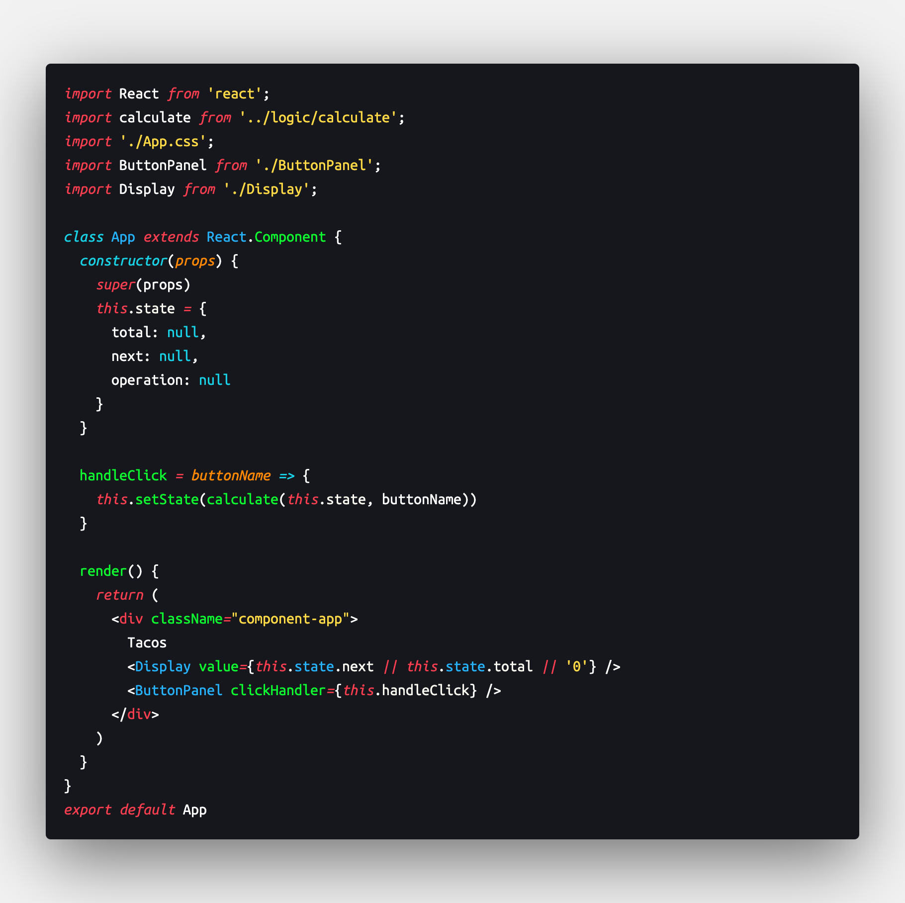

  

<h2 align="center">Oishii theme</h2>
<h5 align="center">Created for you, by <a href="https://www.instagram.com/marlom.dev">@marlom.dev</a></h5>

A very dark and vibrant theme with italicized keywords and operators.

* Based on Monokai Theme
* Super dark and rich editor color scheme
* Vibrant colors for readability
* Italicized keywords and operators compliments "Operator Mono" or similar fonts (optional)
* Customized for JavaScript, React and CSS

Don't forget to review on the marketplace!

**Enjoy!**

## Thanks

Thanks to Morgan Codes for the JSON customization
Thanks to Dylan Marsh for the original Monokai Vibrant theme
Thanks to Sarah Drasner for the demo files used to test the theme